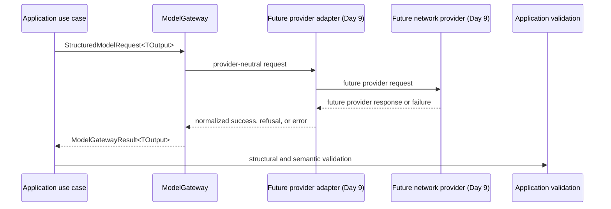

# Model Gateway Contract

**Roadmap slice:** Week 1, Day 8 — Model Gateway Contract  
**Status:** Implemented contract boundary  
**Date:** 2026-07-19

## Purpose

`@opsguard/ai-core` defines the provider-independent boundary for structured model generation. The
boundary gives application code stable request, result, refusal, usage, and failure semantics without
exposing a provider SDK. Day 8 defines and tests this contract only; it does not call a model.

## Implementation specification

- `ModelGateway.generateStructured` accepts an immutable `StructuredModelRequest<TOutput>` and
  resolves to an explicit `success`, `refusal`, or normalized `error` result.
- Requests carry a versioned task, provider-neutral model policy, text messages, a JSON
  Schema-compatible output descriptor, a positive timeout, optional `AbortSignal`, and minimized
  operational metadata.
- Pure constructors validate bounded identifiers, task and schema descriptors, policy limits,
  timeout, usage accounting, result fixtures, and sanitized errors. They return a discriminated
  construction result rather than throwing for expected invalid input.
- Provider and model identifiers are open branded strings. No current vendor or model is encoded in
  the public type system.
- A reusable fake returns a configured sequence, records defensive request snapshots, never logs or
  performs I/O, and throws only for exhausted test configuration.
- No domain, application, HTTP, database, workflow, provider, configuration, or persistence surface
  changes in Day 8.

## Deterministic and probabilistic ownership

The provider may probabilistically produce structured data or refuse a request. The gateway only
normalizes that outcome. The deterministic application remains responsible for tenant derivation,
authorization, schema and semantic validation, policy, workflow state, transactions, approvals,
retries, budgets, side effects, reconciliation, persistence, and audit.

A `success` means only that an adapter returned data in the requested structural channel. The output
is untrusted and is a proposal, not evidence of semantic correctness or permission. A refusal is a
model outcome, not an application authorization denial. No gateway outcome can directly cause a
state transition or external side effect.

## Dependency direction

The contract belongs to `packages/ai-core`. Application use cases may depend on this boundary in a
later roadmap slice, and provider infrastructure may implement it. The domain must not depend on
`ai-core`. `ai-core` imports no HTTP framework, UI framework, database library, workflow runtime, or
provider SDK, and exported contracts contain no vendor request, response, or exception types.

The adapter and provider shown above are future Day 9 surfaces and do not exist in Day 8.

## Request lifecycle

1. An application use case derives tenant and correlation context from trusted application state.
2. It selects a stable task and application-owned model policy.
3. It supplies minimized text messages and an explicit versioned JSON Schema descriptor.
4. It constructs a request with a finite positive timeout and optional caller-owned cancellation
   signal.
5. A gateway implementation returns one normalized result without granting authority.
6. Application code validates successful output structurally and semantically before any decision.
7. Later application policy decides whether to retry, abstain, pause, or request review.

## Request types

### Task

`ModelTask` contains a non-empty bounded `name` and `version`. The name describes a stable
application capability, never a provider model. Day 8 does not define a request-assessment task.

### Model policy

`ModelPolicy` contains allowlists for open provider and model identifiers, a provider-neutral quality
tier, a fallback permission, and a positive maximum-output-token bound. It expresses
application-owned constraints but performs no selection, fallback, retry, pricing, or configuration
loading.

### Messages

`ModelMessage` supports only `system`, `user`, and `assistant` roles with plain text. Messages are
readonly and contain no tool, image, multimodal, executable callback, or provider content-part type.
Authorization context is not implicitly added to messages.

### Output schema

`OutputSchemaDescriptor` contains a bounded name, bounded version, a JSON Schema-compatible object,
and a `strict` flag. The generic `TOutput` preserves caller type information but does not perform
runtime validation. Task-specific schema conversion, structural validation, and domain validation
remain later work.

### Timeout and cancellation

`timeoutMilliseconds` must be a positive finite integer. `signal` is an optional standard
`AbortSignal`; its identity crosses the boundary unchanged. The contract defines no timer. A Day 9
adapter must bind both timeout and cancellation to provider behavior. Cancellation does not prove
that a provider stopped processing unless the provider confirms it.

### Request metadata

`ModelRequestMetadata` contains application request ID, correlation ID, application-derived tenant
reference, prompt version, and operation name. Values are bounded non-empty strings. The object must
not contain raw authentication headers, credentials, secrets, complete request bodies, messages, or
schema contents.

Operation name, task identity, prompt version, and correlation ID are candidates for an approved log
allowlist. Application request ID and tenant reference remain sensitive identifiers and require the
later telemetry policy before logging. Prompts, messages, schemas, and outputs are sensitive and must
not be logged by default.

## Result types

### Success

A `success` contains the typed structured output, branded provider and model IDs, an optional
provider request ID, normalized token usage, normalized completion state, and non-negative latency.
It contains no raw response, hidden reasoning, chain-of-thought, pricing decision, or SDK object.

### Refusal

A `refusal` contains a normalized refusal category, provider and model IDs, an optional provider
request ID, optional usage, and completion state. It contains no structured output and is neither a
gateway failure nor an authorization result. Raw provider refusal text is excluded by default.

### Completion state

Completion is `completed` or `truncated`. Refusal remains a top-level result discriminator.
Unexpected provider completion values must be normalized to an error by a future adapter.

## Usage accounting

`ModelUsage` contains non-negative integer input, output, and total token counts. Total tokens equal
input plus output tokens. Optional cached-input and reasoning-token counts are stable subsets of
input and output respectively. Provider-specific counters and monetary-cost calculation are outside
the contract.

## Provider identity

`ProviderId` and `ModelId` are validated, branded, open strings so adding a provider does not change
application semantics. Both are required for success and refusal. A provider request ID is optional
and is operational correlation only; it is never a tenant, authorization, idempotency, or approval
identifier.

## Normalized errors

The `error` result contains a sanitized `ModelGatewayError` discriminated by:

| Code | Retryable | Contract guidance |
|---|---:|---|
| `INVALID_REQUEST` | No | Change the caller request before another attempt. |
| `AUTHENTICATION` | No | Correct provider credentials or configuration outside this contract. |
| `PERMISSION_DENIED` | No | Correct provider-side permission outside this contract. |
| `RATE_LIMITED` | Yes | A later bounded policy may honor a validated retry-after value. |
| `TIMEOUT` | Yes | A later caller policy decides whether a new attempt is safe. |
| `CANCELLED` | No | Start a new operation only when intentionally requested. |
| `CONTEXT_LIMIT` | No | Reduce or change the request before retrying. |
| `OUTPUT_SCHEMA_MISMATCH` | No | Never retry indefinitely; later policy may change the request. |
| `MALFORMED_RESPONSE` | No | Later policy may allow only a bounded retry. |
| `UNAVAILABLE` | Yes | A later policy may perform a bounded retry. |
| `UNEXPECTED` | No | Conservative until a deterministic classification is added. |

Retryability is derived from the error code by the constructor and cannot be supplied by an adapter.
The safe message is a bounded application-handling description. Errors may include validated
provider/model/request correlation and a non-negative retry-after duration, but never a provider
exception, HTTP response, API key, prompt, raw output, SQL detail, transport stack, or arbitrary
cause object. Expected external failures resolve as `status: 'error'`; only programming defects may
throw.

## Validation and immutability

Pure constructors return `ok: true` with a deeply frozen value or `ok: false` with a stable contract
validation error. They validate empty or oversized identifiers, invalid task/schema/metadata values,
policy bounds, non-positive timeout, negative or non-integer usage, inconsistent totals and subset
counts, invalid latency, malformed success/refusal fixtures, and unsafe error inputs.

The public request/result structures are readonly. JSON values are deep readonly. Constructors and
the fake defensively copy arrays and JSON data; the cancellation signal is intentionally retained by
identity. No mutable global provider state exists.

## Fake adapter and contract tests

`FakeModelGateway` is exported from the explicit `@opsguard/ai-core/testing` entry point. Each
instance owns a copied FIFO outcome queue and frozen request history. It supports success, refusal,
and every normalized error, returns outcomes in order, does no I/O, does not inspect or log sensitive
content, and fails with a stable test-only error when its queue is exhausted.

Contract tests cover complete request forwarding (including cancellation identity), success and
refusal discrimination and metadata, every error category, queue order, call recording, defensive
history copies, configured-outcome isolation, empty-queue failure, instance isolation, public
exports, numeric and identifier invariants, malformed fixtures, and sanitized error construction.
No real provider, environment value, timer, token counter, retry, or network call participates.

## Security mapping

This boundary begins the planned control for threat-model trust boundary TB-08 and backlog control
PC-006. Bounded time/output tokens and explicit failures reduce exposure described by T-021 and
AB-016 but do not implement tenant budgets, concurrency limits, provider kill switches, or retry
policy. Provider-neutral minimized contracts and sanitized failures address parts of T-013 and T-015;
prompt-injection evaluation, provider privacy review, retention, redaction, retrieval eligibility,
and output validation remain open controls under PC-008 and PC-013.

Tenant context must be application-derived before request construction. Model output remains
untrusted. The gateway accepts no tools or callbacks, owns no authorization or state transition, and
performs no side effect. These restrictions preserve ADR-0001 and keep refusal distinct from
permission denial.

## Day 9 adapter obligations

A future provider adapter must map the provider-neutral request to one provider API, enforce timeout
and cancellation at the transport boundary, capture normalized identity/usage/latency/completion,
sanitize all expected provider failures, reject unexpected completion states, and return only the
contract union. It must prove that provider SDK types and exceptions cannot escape. Provider/model
selection, credentials, configuration, bounded retries, and fallback require their separately owned
policies.

## Current limitations and exclusions

Day 8 includes no provider adapter or SDK, API key or environment configuration, network call,
provider/model selection, fallback implementation, prompt, request-assessment schema, task-specific
validation, application use case, HTTP route, database migration or AI-run persistence, workflow,
retry loop, streaming, embeddings, retrieval, tools, telemetry, cost persistence, or UI. The fake is
test infrastructure, not a provider simulation.
