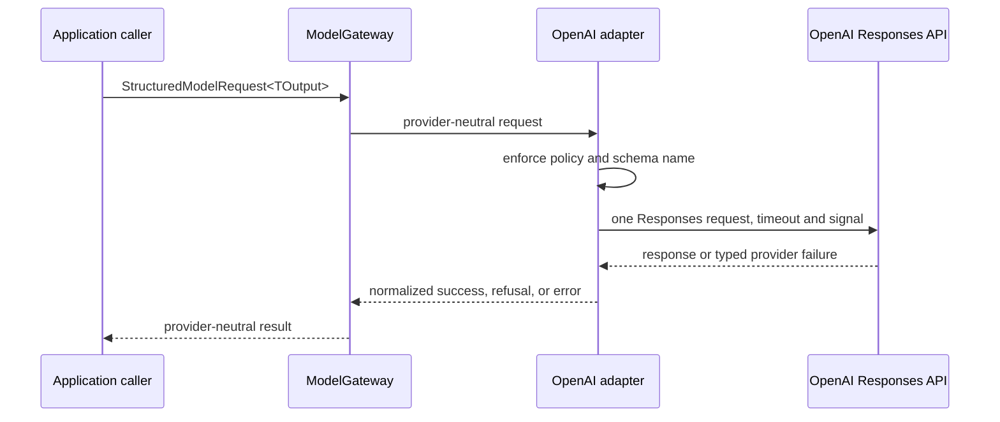

# OpenAI Provider Adapter

**Roadmap slice:** Week 1, Day 9 — First Provider Adapter
**Status:** Implementation specification
**Date:** 2026-07-19

## Purpose

Day 9 adds the first infrastructure implementation of the provider-neutral `ModelGateway`. The
adapter uses `openai@6.48.0` and the OpenAI Responses API to perform one non-streaming structured
generation attempt. It normalizes the provider result without giving the provider authority over
tenant identity, application policy, workflow state, persistence, retries, or side effects.

No application use case or API route invokes the adapter on Day 9.

## Dependency direction and public API

The provider-neutral `@opsguard/ai-core` root remains free of OpenAI SDK types. Provider-specific
construction is available only from `@opsguard/ai-core/openai`:

```ts
createOpenAIModelGateway({ apiKey, modelId }): ModelGateway;
```

The provider entry point exports the factory and stable primitive configuration types. It does not
export the raw OpenAI client, SDK request or response types, error objects, headers, or internal
mappers. `packages/ai-core` is the only package permitted to import `openai`; domain, application,
database, configuration, and delivery packages do not depend on the SDK.

## Configuration and secret handling

`@opsguard/config` explicitly resolves:

- `OPENAI_API_KEY`, required and non-empty only when OpenAI configuration is requested;
- `OPENAI_MODEL`, required, trimmed, non-empty, and configuration-owned; and
- `RUN_OPENAI_INTEGRATION_TESTS`, an explicit `true` or `false` value that defaults to `false`.

The current API server does not resolve this configuration at startup. Error messages identify only
the missing or invalid variable and never include the API key value. The key is held in memory only,
is never returned by an API, and is never written to logs, provider metadata, or request bodies.
Production secret-manager integration remains later work.

The adapter validates non-empty bounded `apiKey` and `modelId` values during construction. A
standards-based injected `fetch` and monotonic clock are supported as code-only deterministic test
seams. Environment configuration cannot select a base URL, fetch implementation, clock, provider ID,
retry behavior, or logging behavior.

## Model and policy enforcement

The adapter has exactly one configured model. Its stable provider ID is `openai`. Before any network
request, the adapter confirms that the request policy contains both `openai` and the configured model
ID. A mismatch returns `INVALID_REQUEST`; it does not call OpenAI, select another model, interpret the
quality tier, perform fallback, or rewrite policy.

The result `modelId` is the actual non-empty model identifier returned by OpenAI. This records alias
resolution without granting the returned model identity authorization significance. A missing or
invalid returned identity is a malformed response.

## Responses API request mapping

Each gateway call maps to one `responses.create` request:

- `model`: configured model ID;
- `input`: one item per gateway message, in the original order, with the original `system`, `user`,
  or `assistant` role and exact text;
- `text.format.type`: `json_schema`;
- `text.format.name`: the unchanged output-schema name;
- `text.format.schema`: the unchanged JSON Schema object;
- `text.format.strict`: the unchanged strictness flag;
- `max_output_tokens`: the request policy maximum;
- `store`: `false`; and
- `stream`: omitted, so the call is non-streaming.

The adapter adds no prompt, instruction, tool, metadata, safety identifier, tenant identifier,
application request ID, correlation ID, prompt version, or operation name. The API key is carried by
SDK authentication only and cannot appear in the JSON body.

## OpenAI-specific schema validation

Before the provider call, the schema name must match `^[A-Za-z0-9_-]{1,64}$`, the current Responses
API requirement. An incompatible name returns `INVALID_REQUEST`. The adapter never truncates,
rewrites, or substitutes a schema name, weakens strict mode, changes property names, invents required
fields, or converts through a task-specific schema library.

## Timeout, cancellation, and retry policy

The OpenAI client is constructed with `maxRetries: 0` and `logLevel: 'off'`. Every provider call
passes `request.timeoutMilliseconds` as the SDK request `timeout` and passes the caller's
`AbortSignal` as the request `signal`. A signal that is already aborted returns `CANCELLED` before a
provider request. In-flight SDK cancellation is also normalized to `CANCELLED`; timeout is normalized
separately to `TIMEOUT`.

There is no timer, sleep, retry, fallback, or recursive attempt in the adapter. Cancellation does not
claim that the provider performed no work. Later application or workflow policy owns any bounded
retry decision.

## Success and completion mapping

A `completed` response must contain exactly one usable structured text value, valid JSON, valid
provider/model identity, and consistent usage. The adapter parses the text as unknown JSON and then
uses the Day 8 constructor to prove it is a supported immutable `JsonValue`. It returns
`completionState: 'completed'` and latency measured from the injected monotonic clock.

For `incomplete` with reason `max_output_tokens`, a complete valid structured JSON value may be
returned with `completionState: 'truncated'`; otherwise the result is `MALFORMED_RESPONSE`.
Content-filter incompletion without a typed refusal is `OUTPUT_SCHEMA_MISMATCH`. A failed response is
classified from its safe typed error code. `queued` or `in_progress` from this non-background,
non-streaming call is `UNEXPECTED`. Provider status strings never cross the adapter.

## Refusal handling

Typed `refusal` content maps to the existing top-level refusal result with category `safety`. The
adapter does not parse refusal text as JSON, return it, log it, or interpret it as application
authorization. Provider ID, actual model ID, optional request ID, available valid usage, and the
normalized completion state are preserved. A response cannot be both success and refusal.

## Usage and provider request IDs

OpenAI usage is mapped without estimation:

- input, output, and total tokens are required;
- cached input tokens are included when present;
- reasoning output tokens are included when present; and
- the Day 8 usage constructor rejects negative, unsafe, or inconsistent counts.

Missing or malformed required usage produces `MALFORMED_RESPONSE`. Day 9 does not calculate money or
persist usage.

The SDK `_request_id`, derived from the `x-request-id` response header, is mapped to
`ProviderRequestId` when present and valid. It is operational correlation only, not a response ID,
tenant ID, credential, authorization value, idempotency key, or model-produced field. Raw headers are
never exposed.

## Normalized errors

The adapter uses fixed safe messages and never copies a provider exception message, body, stack,
headers, prompt, schema, output, or API key into a gateway error.

| Provider or local condition | Gateway code |
|---|---|
| Local policy/schema/configuration rejection | `INVALID_REQUEST` |
| HTTP 400 or 422 invalid request/schema | `INVALID_REQUEST` |
| Typed context-length failure | `CONTEXT_LIMIT` |
| HTTP 401 | `AUTHENTICATION` |
| HTTP 403 | `PERMISSION_DENIED` |
| HTTP 404 configured model unavailable | `INVALID_REQUEST` |
| HTTP 429 | `RATE_LIMITED` |
| SDK connection timeout | `TIMEOUT` |
| Caller cancellation | `CANCELLED` |
| SDK connection failure | `UNAVAILABLE` |
| HTTP 5xx | `UNAVAILABLE` |
| Structurally unusable response or invalid JSON | `MALFORMED_RESPONSE` |
| Completed text that cannot satisfy the structured channel | `OUTPUT_SCHEMA_MISMATCH` |
| Unclassified exception or impossible non-streaming status | `UNEXPECTED` |

Provider and configured model IDs are attached when known. A valid provider request ID is attached
when the SDK exposes it. Retryability remains derived exclusively by the Day 8 error constructor.

## Retry-after advisory metadata

For rate limits, the adapter may read only `retry-after-ms` or `retry-after` from typed SDK error
headers. Milliseconds take precedence. Numeric `retry-after` is interpreted as seconds. HTTP dates
are not parsed on Day 9. Negative, non-finite, unsafe, fractional, or values above 24 hours are
discarded. The adapter never sleeps or retries.

## Logging, redaction, and retention

SDK logging is disabled. The adapter introduces no console or debug logging and does not accept a
logger. Message content, schemas, structured output, refusal text, API keys, authentication headers,
raw errors, response bodies, and application metadata are never logged.

`store: false` disables using the generated response as stored application state retrievable through
the Responses API. It does not mean zero provider retention. Provider abuse-monitoring retention,
data-processing controls, residency, and organizational settings remain external service concerns;
production enablement requires a current provider data-processing review.

## Call sequence



## Deterministic and opt-in tests

Deterministic tests inject a per-instance standards-based fetch implementation and monotonic clock,
exercise the actual SDK and adapter mapping path, record defensive request copies, and never contact
OpenAI. They cover request mapping, policy denial, schema-name rejection, success, refusal, usage,
request identity, every required error class, retry-after, timeout, cancellation, one-attempt
behavior, instance isolation, immutability, redaction, and public export boundaries.

The live integration test is skipped unless `RUN_OPENAI_INTEGRATION_TESTS=true`. When enabled it
requires `OPENAI_API_KEY` and `OPENAI_MODEL`, sends a tiny generic JSON Schema unrelated to request
assessment, makes one inexpensive call, prints no sensitive value, and accepts only normalized
success or refusal. Normal CI contains no OpenAI credential and does not run a live call.

## Current limitations, Day 10 obligations, and exclusions

Day 9 validates transport shape and supported JSON values only. It does not prove that output meets a
task-specific schema or business invariant. Week 1 Day 10 owns `RequestAssessmentV1`, its prompt,
structural validation, domain validation, and application behavior.

Day 9 adds no task-specific prompt, prompt or model database records, `ai_runs` persistence,
migration, application model invocation, API route/startup wiring, tenant-specific provider
configuration, fallback, retry loop, streaming, embedding, tool, retrieval, workflow, UI, evaluation
dataset/runner, telemetry, monetary cost, deployment, or secret-manager integration.
