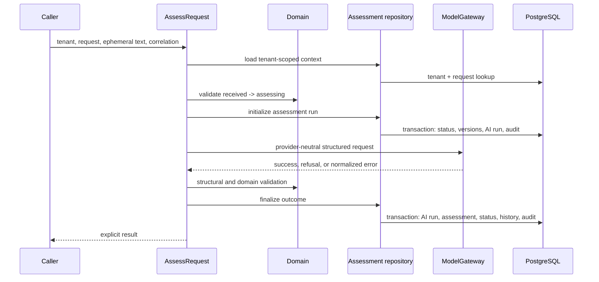

# Request Assessment V1

**Roadmap slice:** Roadmap Day 10 — Structured Request Assessment  
**Status:** Implemented baseline  
**Schema version:** `request-assessment-v1`

## Purpose and scope

Request Assessment V1 is the first complete AI-assisted assessment capability. It classifies and
extracts a tenant-scoped operational request, validates the model proposal, applies deterministic
review policy, and records traceable evidence. It has no HTTP route, user interface, external route
execution, retry, fallback, or approval authority.

The model proposes fields. Domain and application code remain authoritative for tenant scope,
request eligibility, supported values, confidence policy, effective routing, state transitions,
persistence, and audit evidence.

## Dependency direction

The domain package owns the assessment contract and policy without importing AI or infrastructure.
The application package imports only the provider-neutral `@opsguard/ai-core` root and defines the
use case and persistence port. The database package implements that port with Drizzle and
PostgreSQL. Delivery packages do not use the assessment capability on Day 10.

## Contract

`RequestAssessmentV1` contains exactly these required keys:

- `schemaVersion`: literal `request-assessment-v1`;
- `intent`: one supported intent;
- `confidence`: finite number from zero through one;
- `customer`: required `name`, `email`, `phone`, and `accountReference` nullable strings;
- `serviceRequest`: required `summary` plus nullable `requestedService`, `requestedTiming`, and
  `location`;
- `urgencyIndicators`: bounded, duplicate-free urgency values;
- `missingInformation`: bounded, duplicate-free normalized identifiers canonicalized into lexicographic order;
- `proposedRoute`: one supported route; and
- `evidenceReferences`: bounded `{ field, start, end }` references into ephemeral request text.

Unknown nullable values are `null`. Empty semantic strings are rejected rather than silently
invented or normalized. The validated result is a defensive immutable copy.

## Supported vocabulary

Intents are `new_service_request`, `support_request`, `billing_request`, `complaint`,
`cancellation_request`, `general_inquiry`, `unrelated`, and `unknown`.

Proposed and effective routes are `sales`, `support`, `billing`, `operations`, `manual_review`, and
`reject_unrelated`. Urgency indicators are `safety_risk`, `service_outage`, `financial_deadline`,
`legal_deadline`, `customer_escalation`, `time_sensitive`, and `none`. `none` cannot be combined
with another urgency value.

## Prompt version and structured schema

The source-controlled system prompt uses key `request.assessment`, positive version `2`, and a
declared lowercase SHA-256 verified against its exact UTF-8 content by test. The database stores the
key, version, and hash—not prompt content. A conflicting tenant prompt key/version with another hash
fails initialization.

The provider-neutral request uses task `request.assessment` version `1` and strict JSON Schema name
`request_assessment_v1`. Every object declares all required properties and
`additionalProperties: false`. Provider-supported types, enums, nullability, numeric bounds, array
limits, and evidence integers are represented in the schema. Unsupported provider constraints remain
enforced by deterministic runtime validation because provider schema enforcement does not establish
trust.

## Untrusted request handling

The command accepts bounded non-empty request text because the current request table stores no raw
body. It is wrapped in explicit `BEGIN_UNTRUSTED_REQUEST_TEXT` and `END_UNTRUSTED_REQUEST_TEXT`
delimiters. The prompt says the content is data, forbids following embedded instructions, limits the
task to classification and extraction, prohibits authorization and external actions, and forbids
fabricated customer data. Request text is not logged or persisted.

Tenant and correlation identifiers are application metadata, never model authority. The provider
adapter does not transmit that metadata. No tenant secret, API key, current date, tool instruction,
or provider-specific action appears in the prompt.

## Structural validation

The runtime parser accepts unknown input and returns deterministic field/reason errors without raw
output. It rejects non-objects, arrays, prototypes other than ordinary or null JSON objects, missing
or additional keys, unsupported enums, incorrect primitives, malformed nullables, non-finite or
out-of-range confidence, oversized strings or arrays, duplicate normalized identifiers, and malformed
evidence references. Valid missing-information identifiers are canonicalized lexicographically. It
never throws for expected validation failures.

## Domain validation and confidence policy

The named `requestAssessmentReviewThreshold` is `0.75`. Evidence offsets must be non-negative safe
integers and `end` must exceed `start`. Structurally valid evidence items that exceed the ephemeral
request-text length are omitted because evidence is optional; offsets are never clamped or invented.
Overlapping in-range references are allowed because multiple normalized fields may rely on the same
source span.

The following deterministic rules apply:

- confidence below `0.75` requires review and effective route `manual_review`;
- `unknown` always requires review and effective route `manual_review`;
- any declared missing information requires review and effective route `manual_review`;
- proposed `manual_review` remains manual review;
- `unrelated` may propose only `reject_unrelated` or `manual_review`;
- non-`unrelated` intents cannot propose `reject_unrelated`;
- intent-incompatible proposed routes require review and effective route `manual_review`; and
- urgency is evidence only and never authorizes an action.

The proposed route is stored unchanged. The effective route is a separate deterministic result.
Even a valid high-confidence operational route does not execute work on Day 10.

## State and application behavior

Only a tenant-scoped request currently in `received` is eligible. The application loads it by
tenant and request ID, proves the `received → assessing` transition using domain policy, and passes
the expected status and timestamp to a conditional initialization transaction. Missing and
cross-tenant requests share the same not-found result; stale state is an explicit conflict.

All successful assessments end in `pending_review`. This includes high-confidence classifications:
Day 10 has no downstream routing or human-decision implementation and therefore cannot claim work
was completed or automatically reject a request. Refusals, invalid output, normalized provider
failures, and cancellation also move the request from `assessing` to recoverable `pending_review`.

## Persistence and tenant isolation

Initialization atomically:

1. conditionally changes the request to `assessing` and appends status history;
2. ensures the tenant prompt version and model configuration without overwriting conflicts;
3. creates a `running` AI run referencing those exact records; and
4. appends `request.assessment_started` with redacted metadata.

The model call occurs after that transaction commits. Finalization atomically updates the AI run,
inserts a validated assessment on success, changes the request to `pending_review`, appends status
history, and appends the final audit event. Failure at any step rolls back that entire transaction.

`request_assessments` has direct tenant ownership, composite tenant/request and tenant/AI-run
foreign keys, one assessment per tenant AI run, schema/confidence/route checks, JSON type and size
checks, and a tenant/request/time index. Prompt, model, AI-run, request, and assessment lineage is
traceable only through tenant-consistent foreign keys.

The assessment stores confidence as basis points from `0` through `10000`, while the domain exposes
zero through one. Customer fields, service fields, urgency values, missing information, and evidence
references are persisted only after structural and domain validation.

## AI-run, refusal, and error behavior

An AI run is `running` before invocation, `succeeded` only after validated assessment persistence,
`failed` for refusal, invalid output, or normalized provider failure, and `cancelled` for caller
cancellation. Provider request ID, input/output tokens, and latency are recorded only when supplied
by the provider-neutral result. Counts are never estimated and cost is not calculated.

Refusal category and gateway error code remain explicit application outcomes. Persistence records
only a safe normalized classification. Raw refusal text, provider messages, exception objects,
headers, response bodies, stacks, and model output never cross into persistence or audit metadata.
There is no retry.

## Audit and sensitive data

Audit event types are `request.assessment_started`, `request.assessment_completed`,
`request.assessment_review_required`, `request.assessment_failed`, and
`request.assessment_cancelled`. Metadata may contain schema version, intent, proposed/effective
route, review flag, prompt version, model configuration ID, and normalized failure code.

Audit metadata never contains request text, customer name/email/phone, service description,
evidence text, prompt content, model output, credentials, or raw provider failures. Evidence stores
offset references only; it does not duplicate source excerpts or confer authority.

## Sequence

## Test strategy

Domain tests exhaust required keys, strict objects, enums, bounds, evidence, consistency rules,
routing, and immutability. Application tests use `FakeModelGateway` and an in-memory port fake to
verify one provider-neutral call, prompt/schema mapping, every result branch, persistence commands,
recoverable failure behavior, and redaction. PostgreSQL integration tests cover empty migration,
tenant constraints, checks, version conflicts, transaction rollback, lineage, and audit metadata.
Normal tests never contact OpenAI; the existing live adapter test remains opt-in.

## Limitations and exclusions

Day 10 intentionally has no API route/startup wiring, UI, CLI demo, evaluation dataset or runner,
telemetry instrumentation, retry/fallback, Temporal workflow, retrieval, embeddings, tools,
webhooks, messages, downstream execution, customer entity, CRM, automatic approval/rejection, cost,
raw prompt/request/response storage, or provider-specific application dependency.

Roadmap Day 11 owns the initial evaluation dataset. It is not started by this slice.
