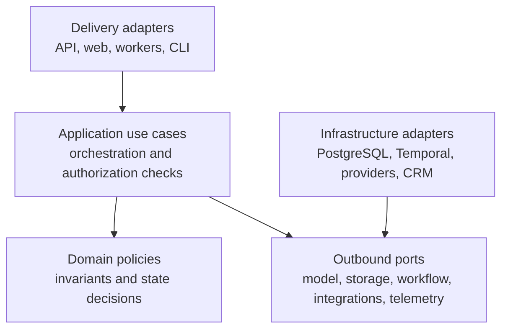

# OpsGuard AI Domain Boundaries

**Roadmap slice:** Week 1, Day 1 — Product Scope and Architectural Boundaries  
**Status:** Accepted baseline  
**Date:** 2026-07-17

## Boundary strategy

OpsGuard AI uses a modular, hexagonal architecture. A domain boundary owns its rules and state vocabulary. Other boundaries interact through application ports, explicit commands and queries, stable identifiers, immutable snapshots, or domain events; they do not mutate another boundary's records directly.

These are logical ownership boundaries. Day 1 does not create packages, tables, migrations, queues, or service processes. Physical package and deployment decisions remain subject to their scheduled roadmap slices.

## Bounded contexts

| Boundary | Owns | Must not own |
|---|---|---|
| Identity and Tenant Access | Tenant membership, roles, service-account scope, actor context, permission evaluation, support-access grants | Business workflow decisions, model interpretation, or third-party execution |
| Request Intake | Request identity, source receipt, validation result, deduplication outcome, original payload reference, request status history | Intent inference, policy approval, or integration side effects |
| Request Assessment | Validated classification, extracted fields, missing information, assessment confidence, evidence references, assessment version | Provider SDK calls, authorization, final risk, or workflow transitions |
| Knowledge and Policy Content | Tenant documents, versions, provenance, activation, supersession, eligibility metadata, service catalog, tenant policy content | Final authorization decisions, model execution, or request state |
| Decision and Proposal | Deterministic policy evaluation, risk result, route, immutable proposal version, required approval level | Human identity, provider execution, or mutation of source knowledge |
| Approval and Review | Review assignment, reviewer corrections, approval/rejection/revision decision, decision expiry, separation of duties | Creating a new proposal after approval or executing external actions |
| Integration Execution and Reconciliation | Allowed tool definition, execution request, idempotency record, external correlation ID, result, retry classification, reconciliation | Model-selected permission, tenant resolution, or approval policy |
| AI Execution | Provider-neutral model/embedding capabilities, AI-run lifecycle, model and prompt references, usage, latency, normalized provider failures | Domain authorization, tenant choice, workflow state, or side effects |
| Workflow Coordination | Long-running process position, timers, signals, recovery coordination, cancellation, and orchestration history | Redefining domain invariants or treating workflow history as authorization |
| Audit and Evidence | Append-only material events, actor and policy references, evidence lineage, model/prompt references, approval and external-operation references | Mutable operational source of truth or secret storage |
| Evaluation and Quality | Versioned datasets, cases, graders, evaluation runs, results, and release-gate evidence | Production authorization or automatic promotion without deterministic gates |
| Operations and Cost Control | Tenant budgets, model policy, provider availability policy, cost ledger, quotas, kill-switch state, operational metrics | Business approval decisions or editing historical AI usage |

## Dependency direction

The domain defines policy without importing frameworks or provider SDKs. Application use cases coordinate domain decisions and ports. Infrastructure implements ports and may depend on application-owned contracts, never the reverse.

## Cross-boundary invariants

1. **Tenant context is immutable and application-derived.** No boundary accepts a payload or model-provided tenant ID as authority.
2. **Tenant-owned references remain tenant-scoped.** A relationship between tenant-owned records must include the same tenant context and must fail closed on mismatch.
3. **AI output has proposal status only.** It becomes usable only after structural validation, semantic validation, tenant-filtered evidence checks, and deterministic policy evaluation.
4. **Proposals are immutable and versioned.** A reviewer decision applies to one exact proposal version; revision creates a new version.
5. **Execution requires current authority.** Permission, tenant, workflow state, risk policy, approval validity, and proposal freshness are checked again immediately before a side effect.
6. **Business effects are idempotent.** Duplicate delivery, replay, retry, or worker recovery must not create duplicate external records or communications.
7. **Unknown external status is not failure.** It is a reconciliation state; the system queries by correlation or idempotency identity before retrying.
8. **Audit history is append-only.** Corrections add new events and versions; they do not rewrite material historical decisions.
9. **Knowledge eligibility is deterministic.** Activation, effective dates, access classification, deletion, quarantine, and supersession determine what retrieval may use.
10. **Failure is explicit.** Invalid model output, missing evidence, exhausted budget, expired approval, or unavailable dependency results in a defined review, pause, retry, rejection, or reconciliation state.

## Information passed between boundaries

Boundaries should exchange the minimum information needed:

- **Identity and Tenant Access → application use case:** immutable execution context containing actor, tenant, grants, authentication method, and correlation identity.
- **Request Intake → Request Assessment:** request ID plus a validated, minimized content reference; not an authority-bearing tenant supplied by the payload.
- **AI Execution → Request Assessment:** structured candidate output, provider-neutral status, model/prompt version, usage, latency, and normalized error.
- **Knowledge and Policy Content → Request Assessment/Decision:** authorized evidence with tenant, document version, chunk provenance, eligibility, and citation identity.
- **Decision and Proposal → Approval and Review:** immutable proposal ID/version, risk, required permission, evidence references, and expiry rules.
- **Approval and Review → Integration Execution:** approval decision reference only; execution still revalidates current state and authorization.
- **Integration Execution → Workflow Coordination:** normalized operation result or explicit unknown status with correlation and reconciliation data.
- **All material boundaries → Audit and Evidence:** append-only event facts with redacted or referenced sensitive values.

## Transaction and consistency boundary

- A local database transaction must protect each atomic domain change and its durable event or outbox record when that pattern is introduced.
- Human approval waits and external calls are never held inside a database transaction.
- Cross-boundary progress is coordinated through persisted state and replay-safe messages or workflow history.
- External systems are not assumed to participate in distributed transactions; idempotency and reconciliation provide business-level consistency.

## Initial conceptual events

The following names describe cross-boundary facts, not final schemas:

- `request.received`
- `request.assessment_completed`
- `proposal.created`
- `approval.recorded`
- `external_operation.requested`
- `external_operation.reconciled`
- `request.completed`

Event envelopes, delivery guarantees, versioning, and persistence are deferred to the appropriate application, database, and workflow roadmap tasks.

## Deferred boundary decisions

- Whether identity and authorization remain one module or split after policy complexity is known.
- Whether tenant policy rules use code, configuration, or a constrained policy engine.
- The exact line between request status and durable workflow status.
- The first CRM and email/ticket provider adapters.
- The physical package layout for retrieval and workflow modules beyond the initial roadmap foundation.
- Event schema versioning and outbox/inbox implementation details.

