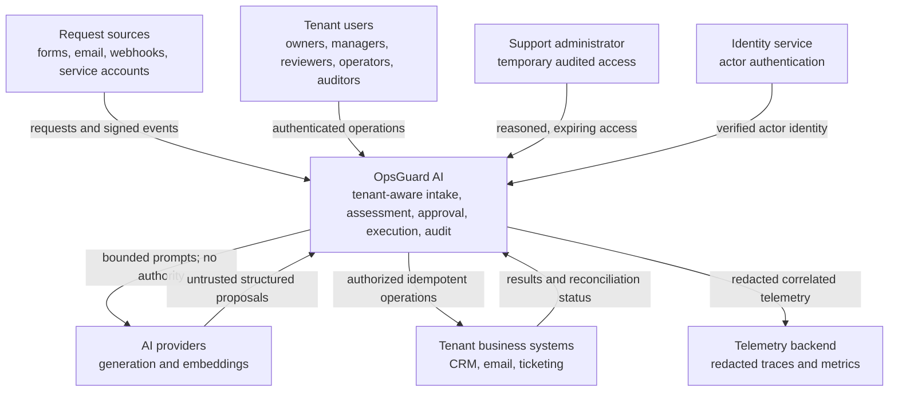

# OpsGuard AI System Context

**Roadmap slice:** Week 1, Day 1 — Product Scope and Architectural Boundaries  
**Status:** Accepted baseline  
**Date:** 2026-07-17

## Purpose

This document defines what is inside the OpsGuard AI system boundary, the people and systems that interact with it, and the trust boundaries that every later implementation must preserve. It is a conceptual context, not a deployment diagram or code scaffold.

## Context diagram

## Inside the OpsGuard AI boundary

The system is responsible for:

- authenticated and tenant-scoped request handling;
- request validation, durable identity, deduplication, and workflow state;
- tenant document and policy lifecycle;
- model-provider abstraction and AI-run metadata;
- structured assessment, evidence retrieval, and citation validation;
- deterministic business rules, risk classification, and approval policy;
- review queues and immutable proposal decisions;
- constrained integration execution, retry, and reconciliation;
- audit history, evaluation evidence, observability, and cost controls; and
- storage and processing adapters behind application-owned ports.

The planned internal architecture is hexagonal: domain and application policies define ports; provider SDKs and infrastructure are adapters. Dependencies point inward. External SDK types must not enter the domain model.

## External actors and systems

| Actor or system | Interaction | Authority and trust position |
|---|---|---|
| Request source | Submits forms, emails, or webhook events | Untrusted until source, signature, schema, tenant mapping, and replay status are verified |
| Tenant user | Reviews requests, manages allowed configuration, and makes approval decisions | Authenticated, but authorized per tenant, permission, assignment, risk, and workflow state |
| Service account | Performs narrow machine-to-machine intake | Credential is scoped; it cannot choose a tenant or gain interactive user permissions |
| Support administrator | Troubleshoots tenant issues | No standing tenant access; access must be explicit, temporary, reasoned, expiring, and audited |
| Identity service | Authenticates human actors and supplies stable identity claims | Authentication input only; OpsGuard still resolves tenant membership and authorization |
| AI provider | Generates structured classifications, extractions, rankings, drafts, and proposals | Probabilistic and untrusted; never an authorization or side-effect authority |
| CRM/email/ticket provider | Receives authorized operations and returns results | External side-effect boundary; outcomes can be delayed, duplicated, ambiguous, or unavailable |
| Telemetry backend | Receives redacted traces and metrics | Must not receive secrets, raw sensitive prompts, full tenant documents, or authority-bearing credentials |

## Primary flow

1. A request enters through an allowed source.
2. OpsGuard verifies the source, derives tenant and actor context, validates the payload, and deduplicates it.
3. Application use cases persist the request and invoke AI capabilities only through provider-neutral ports.
4. Model output is schema-validated and treated as a proposal.
5. Authorized tenant knowledge is retrieved and deterministic rules decide whether the proposal may continue, needs information, requires review, or must be rejected.
6. If review is required, an authorized human acts on an immutable proposal version with supporting evidence.
7. Before any external write, OpsGuard rechecks tenant, actor, permission, risk, approval, current proposal version, and workflow state.
8. OpsGuard performs an idempotent integration operation and reconciles unknown outcomes before retrying.
9. Decisions, versions, evidence, usage, cost, approval, and outcome are recorded for audit and evaluation.

## Trust boundaries

### TB-1: Untrusted ingress to authenticated application context

Form data, email content, files, webhook bodies, headers, and payload tenant IDs are untrusted. Tenant identity must be derived from a verified host, credential, integration mapping, or authenticated membership—not copied from request content.

### TB-2: Authenticated actor to authorized tenant operation

Authentication does not imply authorization. Every use case must verify tenant membership, permission, contextual policy, assignment, workflow state, and separation-of-duties rules where applicable.

### TB-3: Tenant data boundary inside shared infrastructure

All tenant-owned records, storage objects, retrieval queries, cache keys, workflow references, costs, and evaluation samples must carry the application-derived tenant context. Cross-tenant relationships must be impossible by repository contract and, where supported, database constraints.

### TB-4: Deterministic application to probabilistic model provider

Prompts and retrieved evidence leave the controlled application boundary. Inputs must be minimized, classified, and redacted where required. Returned text, structured data, citations, tool proposals, and confidence are untrusted until independently validated.

### TB-5: Application to external side-effect systems

CRM, email, and ticket operations can fail before or after the remote system commits. OpsGuard must use least-privilege credentials, stable idempotency or correlation identifiers, bounded retry, and reconciliation before repeating a write.

### TB-6: Core processing to telemetry and support access

Telemetry and support workflows can unintentionally create secondary access paths. Logs and traces must be redacted and tenant-pseudonymous. Support access must be time-bounded and recorded.

## Architectural constraints

- Domain policy cannot depend on React, Fastify, Drizzle, Temporal, model SDKs, or integration SDKs.
- The model gateway exposes stable capabilities rather than provider-specific request and response types.
- External side effects occur only through application-authorized ports.
- No workflow transition is valid solely because a model requested it.
- Database transactions protect local state; external outcomes require idempotency and reconciliation rather than distributed transactions.
- Every asynchronous message and durable workflow reference must be resolvable to tenant-owned state.

Domain ownership is detailed in [Domain Boundaries](domain-boundaries.md). The initial security implications are recorded in the [Initial Threat Model](../security/initial-threat-model.md).

