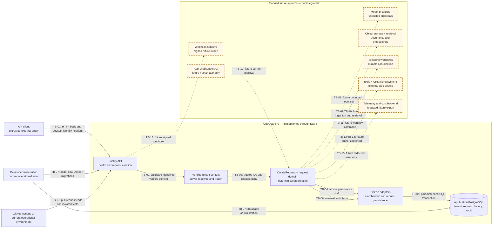
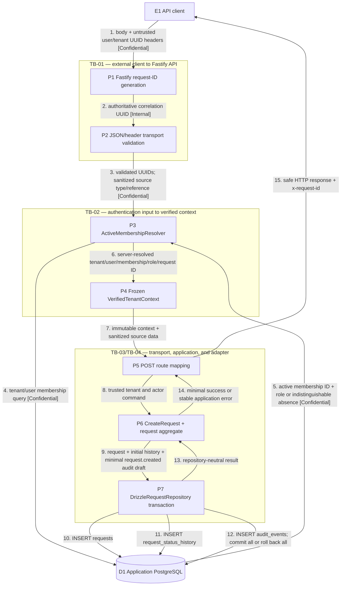

# OpsGuard AI threat-model baseline

**Roadmap slice:** Week 1, Day 7 — Threat-Model Baseline
**Status:** Accepted authoritative baseline
**Date:** 2026-07-18

## Purpose and authority

This document defines the implementation-grounded security analysis method and inventory for the
OpsGuard AI system through Week 1, Day 6. It separates controls verified in source or automated
tests from future V1 controls described only by the roadmap.

This is the authoritative security baseline. The [Day 1 Initial Threat Model](initial-threat-model.md)
is superseded and retained only as historical input; useful prior threats are preserved here with
current identifiers, implementation evidence, and dispositions.

This is an engineering prioritization aid. It is not a claim that the system is production-secure,
a compliance assessment, a penetration test, or a quantitative loss forecast.

## Day 7 objective

Day 7 produces documentation and analysis only:

- one current/future system context;
- one Level 1 data-flow model for request creation;
- stable inventories for assets, actors, entry points, and trust boundaries;
- a lightweight STRIDE threat catalogue;
- a prioritized abuse-case backlog;
- current-control evidence and planned-control ownership; and
- a repeatable verification and review procedure.

No runtime behavior, dependency, schema, migration, route, middleware, test, infrastructure, or CI
change belongs to this slice.

## Scope states

### Implemented through Day 6

The current system consists of:

- an API client calling Fastify `GET /health` or `POST /v1/requests`;
- server-generated correlation IDs and stable public error envelopes;
- untrusted development/test user and tenant headers;
- UUID parsing, active-membership lookup, active-tenant lookup, and a frozen verified context;
- the `CreateRequest` application use case and immutable request aggregate;
- a Drizzle repository and PostgreSQL transaction that insert request, initial history, and
  `request.created` audit records;
- the application PostgreSQL database and its tenant-aware constraints;
- repository configuration, ignored local environment values, GitHub Actions CI, and guarded
  isolated PostgreSQL integration tests; and
- local Docker services. Redis, MinIO, Temporal, OpenTelemetry Collector, and Jaeger are running
  infrastructure foundations but are not used by application code.

### Planned future surfaces

The following are modelled only as future trust boundaries:

- model providers, prompts, structured output, and model-cost accounting;
- document ingestion, object storage, retrieval, embeddings, and vector search;
- Temporal workflow workers and durable activity state;
- typed tools, human approval, and external side effects;
- webhooks and CRM, email, or ticket integrations;
- application telemetry and model-cost backends; and
- a human approval and support-access UI.

No current control may rely on one of these future components.

## Method

The baseline uses lightweight STRIDE plus concrete abuse cases:

| STRIDE category | Question used in this model |
|---|---|
| Spoofing | Can an actor, tenant, source, correlation identity, or future provider be impersonated? |
| Tampering | Can request, context, state, audit, evidence, workflow, or integration data be changed improperly? |
| Repudiation | Can a material action occur without reliable actor, state, or outcome evidence? |
| Information disclosure | Can tenant data, credentials, internal errors, prompts, or telemetry cross an unauthorized boundary? |
| Denial of service | Can traffic, retries, storage, connections, telemetry, or model usage exhaust availability or cost? |
| Elevation of privilege | Can authentication, model output, tools, support access, or dependencies gain ungranted authority? |

Each threat record uses a stable `T-nnn` identifier and names its trust boundary, actor, assets,
scenario, rating, current controls, gaps, planned controls, roadmap owner, evidence, and residual
disposition. Abuse cases use `AB-nnn`; trust boundaries use `TB-nn`; assets use `A-nn`; actors use
`AC-nn`; and entry points use `EP-nn`.

## Control-status vocabulary

Only these terms describe control state:

| Status | Meaning |
|---|---|
| Implemented | Source or configuration exists through Day 6 and direct evidence verifies the claimed behavior. |
| Partially implemented | A narrower control exists, but a material part of the stated security outcome is absent. |
| Planned | The roadmap owns the control, but no current implementation is claimed. |
| Accepted for current phase | A known residual risk is tolerated only for the present non-production phase. |
| Out of scope | The control or surface is outside V1 or outside the stated system boundary. |

Documentation intent alone is not implementation evidence.

## Risk rating

Likelihood and impact are ordinal engineering judgments:

| Value | Likelihood | Impact |
|---:|---|---|
| 1 | Unlikely in the scoped state | Low: localized, readily recoverable effect |
| 2 | Possible | Moderate: tenant, integrity, operational, or availability effect requiring intervention |
| 3 | Likely without further control | High: cross-tenant, credential, material external-effect, or sustained availability/cost effect |

`Risk score = likelihood × impact`:

- 1–2: Low;
- 3–4: Medium; and
- 6–9: High.

Ratings prioritize engineering work; they are not probabilities or financial guarantees. Initial
risk assumes listed current controls can fail or be bypassed. Residual disposition states what is
accepted now or what must be addressed before the owning future surface is enabled.

## Asset inventory

Classification means: **Public** may be disclosed intentionally; **Internal** is operational but
not normally public; **Confidential** is tenant, identity, security, or business data whose
unauthorized disclosure matters; **Secret** grants access or signing authority.

| ID | State | Asset | Classification | Rationale |
|---|---|---|---|---|
| A-01 | Current | Tenant UUID and tenant selection | Internal | The identifier is not a credential, but its authoritative association controls data scope. |
| A-02 | Current | User UUID, email, membership, role, and status | Confidential | Identity and authorization metadata can expose people and access structure. |
| A-03 | Current | Development/test identity headers | Confidential | They carry untrusted identity selections; they are not production credentials. |
| A-04 | Current | Request record and source reference | Confidential | Source references can identify tenant business activity or an external record. |
| A-05 | Current | Request status history | Confidential | It reveals request lifecycle and actor association. |
| A-06 | Current | Audit records | Confidential | Events link tenant, actor, entity, time, and operational facts. |
| A-07 | Current | Correlation ID | Internal | It supports diagnostics but grants no authority and is separate from the request ID. |
| A-08 | Current | Application PostgreSQL data | Confidential | It contains all current tenant, identity, request, and audit records. |
| A-09 | Current | PostgreSQL credentials | Secret | They grant database access within their privilege scope. |
| A-10 | Current | Environment and repository configuration | Internal | Configuration reveals topology; populated secret values remain Secret. |
| A-11 | Current | Application logs | Internal | Current messages are minimized, but operational identifiers remain non-public. |
| A-12 | Current | CI credentials, job data, caches, and artifacts | Secret / Internal | Tokens grant CI authority; logs and artifacts may expose operational data. |
| A-13 | Current | Source code, lockfile, and dependencies | Internal / Public | Source is project-internal; public dependency metadata remains supply-chain sensitive. |
| A-14 | Future | Prompts, model inputs, outputs, and evaluation cases | Confidential | They may contain tenant content, policies, derived facts, or adversarial material. |
| A-15 | Future | Provider credentials and webhook secrets | Secret | They authorize provider calls or authenticate external senders. |
| A-16 | Future | Retrieved documents, embeddings, and object-storage objects | Confidential | They contain or derive from tenant knowledge and customer content. |
| A-17 | Future | Workflow state, proposals, approvals, and tool operations | Confidential | They encode decisions, authority, and side-effect state. |
| A-18 | Future | Tool credentials and external integration identifiers | Secret / Confidential | Credentials grant effects; identifiers support reconciliation and may expose business records. |
| A-19 | Future | Token, cost, telemetry, and budget records | Internal / Confidential | Usage can reveal tenant activity and commercially sensitive patterns. |

## Actor inventory

| ID | State | Actor | Trust position |
|---|---|---|---|
| AC-01 | Current | Unauthenticated external client | Fully untrusted; may call health or attempt protected request creation. |
| AC-02 | Current | Legitimate active tenant member | Authenticated only by the stub; authorized for Day 6 creation after membership lookup. |
| AC-03 | Current | Malicious tenant member | Has a real active membership but may tamper with tenant, source, or request data. |
| AC-04 | Current | Cross-tenant user | Presents a valid user with a tenant where that user lacks active membership. |
| AC-05 | Current | Suspended member or member of suspended tenant | Must receive the same access denial as other absent active memberships. |
| AC-06 | Current | Developer | Controls local code, `.env`, Docker, migrations, and test commands. |
| AC-07 | Current | CI runner or malicious pull request | Executes repository-defined jobs with read-only repository permissions and CI environment values. |
| AC-08 | Current | Database administrator | Has direct data authority outside application authorization and audit guarantees. |
| AC-09 | Current | Compromised application dependency | Executes inside the Node.js process or build and may bypass intended boundaries. |
| AC-10 | Current | Compromised developer workstation | Can steal local credentials or alter code, containers, and evidence. |
| AC-11 | Future | External webhook sender | Untrusted until signature, freshness, source mapping, and replay checks pass. |
| AC-12 | Future | Model provider or malicious model output | External probabilistic system with no authorization or side-effect authority. |
| AC-13 | Future | Malicious uploaded-document author | Supplies indirect instructions or content intended to corrupt retrieval and proposals. |
| AC-14 | Future | CRM, email, or ticket provider | External outcome authority that may be delayed, duplicated, or ambiguous. |
| AC-15 | Future | Support operator or workflow worker | Requires explicit bounded authority; neither surface currently exists. |

## Entry-point inventory

| ID | State | Entry point | Data and authority |
|---|---|---|---|
| EP-01 | Current | `GET /health` | Unauthenticated liveness only; no dependency readiness or sensitive details. |
| EP-02 | Current | `POST /v1/requests` JSON body | Untrusted source type/reference and removable extra properties; no tenant authority. |
| EP-03 | Current | `x-opsguard-user-id` and `x-opsguard-tenant-id` | Untrusted development identity selection validated and resolved server-side. |
| EP-04 | Current | API process environment | Listener and database settings; populated credentials are secret-bearing input. |
| EP-05 | Current | PostgreSQL connection | Parameterized Drizzle operations and administrative migration/test access. |
| EP-06 | Current | Pull request, lockfile, and GitHub Actions workflow | Code and dependency changes executed by CI with `contents: read`. |
| EP-07 | Current | Developer CLI, `.env`, Docker ports, and service consoles | Local administrative surface bound to loopback by Compose defaults. |
| EP-08 | Future | Model and embedding provider APIs | Prompts/evidence leave the system; outputs return untrusted. |
| EP-09 | Future | Document upload, object storage, and retrieval | Untrusted files/content and tenant-filtered data access. |
| EP-10 | Future | Temporal task/activity boundary | Replayable workflow commands and durable state. |
| EP-11 | Future | Tool and external integration APIs | Potentially consequential, idempotent side effects. |
| EP-12 | Future | Webhook receiver | Signed external payload, freshness, source mapping, and replay identity. |
| EP-13 | Future | Telemetry/model-cost export | Redacted operational and usage data crossing to a backend. |
| EP-14 | Future | Human approval and support UI | Authenticated decisions and temporary support authority. |

## System context diagram

Solid nodes and flows are implemented through Day 6. Dashed nodes and flows are future V1 surfaces;
their presence does not claim an integration or control exists today.

## Level 1 data-flow diagram

The current data-flow model covers only `POST /v1/requests`. `GET /health` terminates at the API and
does not query PostgreSQL. Sensitive values are labelled; the development headers are untrusted and
are not credentials.

The ordering is security-relevant: membership is resolved before context construction; the route
does not reconstruct tenant or actor identity; and all three writes share one local transaction.

## Trust-boundary inventory

| ID | State | Boundary | Principal data | Representative threat | Current or planned control |
|---|---|---|---|---|---|
| TB-01 | Current | External client to API | Headers, JSON, correlation ID, response | Forgery, malformed/oversized input, flooding, body tenant spoof | Implemented UUID/schema validation, extra-field removal, server request IDs, stable errors; rate/byte controls Planned. |
| TB-02 | Current | Authentication input to verified tenant context | User, tenant, membership, role | Client membership claim, inactive membership, tenant mismatch, production use of stub | Implemented server lookup, active membership/tenant predicates, frozen context; production identity Planned. |
| TB-03 | Current | API transport to application use case | Trusted IDs, source type/reference | Body-derived authority, HTTP leakage, bypassed domain validation | Implemented route mapping from context and application/domain validation. |
| TB-04 | Current | Application to database adapter | Aggregate, history, audit draft | Missing tenant scope, partial write, duplicate, repository bypass | Implemented explicit tenant payload and atomic port; non-HTTP authorization remains a gap. |
| TB-05 | Current | Database adapter to PostgreSQL | SQL parameters, credentials, records | Injection, wrong target, connection exhaustion, excessive privilege, SQL leakage | Implemented Drizzle parameters, Temporal-name guard, pool bound, constraints, error normalization; least-privilege production roles Planned. |
| TB-06 | Current | Application to logging and audit | Correlation/failure category, audit facts | Headers/body/SQL leakage, cross-tenant audit, audit tampering | Implemented minimal application logging and audit metadata; database-enforced append-only audit and retention Planned. |
| TB-07 | Current | Developer/CI to repository and infrastructure | Code, lockfile, env, images, test databases | Secret commit, dependency compromise, malicious PR, unsafe cleanup | Implemented ignored `.env`, frozen lockfile CI, read-only CI permission, guarded test DB names; provenance/scanning and production procedures Planned. |
| TB-08 | Future | Application to model provider | Prompt, evidence, structured proposal, usage | Direct injection, leakage, malformed output, denial of wallet | Planned provider-neutral gateway, minimization, schemas, time/token bounds, evaluations, kill switch — Day 8 and later AI tasks. |
| TB-09 | Future | Ingestion to object storage | Files, extracted content, object identity | Malware, active content, tenant-object mismatch, poisoned document | Planned allowlist, size/type checks, scanning, isolated parsing, tenant object keys, quarantine — document-ingestion task. |
| TB-10 | Future | Retrieval to vector store | Query, embeddings, chunks, provenance | Cross-tenant retrieval, indirect injection, stale/deleted evidence | Planned tenant/eligibility filters, bounded retrieval, provenance, deletion/supersession tests — retrieval task. |
| TB-11 | Future | Workflow worker to Temporal | Workflow/activity IDs, retries, state | Tenant mismatch, replay, retry storm, stale authorization | Planned tenant-qualified workflow identity, bounded retries, idempotent activities, revalidation — workflow task. |
| TB-12 | Future | Model proposal to tool authorization/approval | Proposal, tool ID/args, approval | Excessive agency, self-approval, replayed effect | Planned typed registry, deterministic policy, read/write split, approval, bounded steps, audit — tool/approval tasks. |
| TB-13 | Future | Webhook sender to receiver | Signature, timestamp, external ID, payload | Unsigned/spoofed/replayed event, SSRF, duplicate intake | Planned signature/freshness verification, source mapping, schema, receipt uniqueness, rate limit — webhook task. |
| TB-14 | Future | Application to CRM/email/ticket provider | Credential, idempotency key, operation/result | Duplicate record, ambiguous timeout, over-privileged credential | Planned least privilege, stable idempotency, correlation lookup, bounded retry, reconciliation — integration task. |
| TB-15 | Future | Application to telemetry/cost backend | Trace, metrics, tenant/cost dimensions | Prompt/document leakage, cross-tenant telemetry, high-cardinality cost | Planned allowlisted fields, redaction, pseudonymous dimensions, budgets, retention and access controls — observability/cost tasks. |

## Threat catalogue

The `L/I/R` column is likelihood, impact, and initial score. Evidence paths do not imply controls
beyond the exact behaviour named.

| ID | Title / STRIDE | Boundary; actor; assets | Scenario and impact | L/I/R | Current controls and gaps | Planned control; owner; verification; residual disposition |
|---|---|---|---|---:|---|---|
| T-001 | Tenant identity spoofing / S,E | TB-01, TB-02; AC-01/03/04; A-01–A-06 | Body or forged header selects another tenant or membership and persists cross-tenant data. | 3/3/9 High | Implemented: body extras removed, UUIDs parsed, membership ID resolved by active user/tenant lookup, frozen context. Gap: headers are a dev stub, not authentication. | Production identity plus source-to-tenant mapping; Identity and Tenant Access task; negative identity/body integration tests; Medium, Accepted for current phase only while non-production. |
| T-002 | Suspended or mismatched membership use / S,E | TB-02; AC-04/05; A-01–A-03 | Valid UUIDs probe or use suspended membership, suspended tenant, or a user/tenant mismatch. | 2/3/6 High | Implemented: resolver requires active membership and active tenant and returns indistinguishable absence. Gap: users have no lifecycle status and authorization can become stale after lookup. | Production session/user lifecycle and revalidation policy; Identity task; suspended user/session and concurrency tests; Medium before production. |
| T-003 | Cross-tenant direct-object or repository access / T,E,I | TB-03–TB-05; AC-03/08/09; A-04–A-08 | A future read or non-HTTP caller omits tenant predicate or combines tenant A IDs with tenant B. | 2/3/6 High | Partially implemented: explicit tenant fields and composite FKs reject cross-tenant creator/history/audit links for current writes. Gaps: no read route/repository, RLS, DB role isolation, or application authorization wrapper outside HTTP. | Tenant-scoped repository contracts, negative tests for every store/cache/workflow and RLS evaluation; each owning data task; High until each new access path proves isolation. |
| T-004 | Development auth stub enabled in production / S,E | TB-02, TB-07; AC-01/06; A-01–A-03/A-10 | An exposed deployment accepts arbitrary UUID headers as identity. | 3/3/9 High | Partially implemented: docs warn that the stub is non-production. Gap: no runtime environment prohibition. | Replace stub and add fail-closed production configuration guard; production-auth task; startup/deployment test must refuse stub in production; High, release-blocking before deployment. |
| T-005 | API input abuse and request flooding / D,T | TB-01; AC-01/03; A-04/A-08 | Malformed, large, repeated, or malicious source references exhaust API/DB capacity or persist hostile display content. | 3/2/6 High | Partially implemented: JSON/schema limits source reference to 255 and duplicate uniqueness limits identical tenant source keys. Gaps: no HTTP body-byte limit policy, rate limit, tenant quota, content-output encoding proof, or backpressure policy. | Body/rate/concurrency limits, tenant quotas, safe rendering, load/adversarial tests; ingress/operations tasks; Medium after controls. |
| T-006 | Sensitive data or internal error leakage / I | TB-01, TB-06; AC-01/06; A-02–A-12 | Headers, request body, source reference, SQLSTATE, constraint, URL, stack, or secrets reach logs/API/CI artifacts. | 2/3/6 High | Implemented: stable envelopes; app logs only request ID/failure category; audit metadata omits source reference. Gap: framework/dependency/CI logging, retention, and access are not centrally governed. | Structured allowlist/redaction, retention/access policy, secret scanning, log-capture tests; observability/security operations tasks; Medium. |
| T-007 | Database credential, target, or privilege misuse / S,E,I,D | TB-05, TB-07; AC-06/08/10; A-08–A-10 | Credentials leak, app targets the wrong DB, pool is exhausted, or an over-privileged role tampers with tenant/audit data. | 2/3/6 High | Partially implemented: required config, local loopback, max pool 10, Temporal database-name guard, ignored `.env`. Gaps: local defaults, no secret manager, host allowlist, least-privilege production role, rotation, HA, or audit immutability. | Managed secrets, environment allowlist, least-privilege roles, rotation, capacity/backup runbooks; deployment/database tasks; configuration-refusal and database-privilege tests; High before production. |
| T-008 | Duplicate intake, race, or transaction retry / T,R | TB-04, TB-05; AC-03/09; A-04–A-06 | Concurrent identical intake or retry creates multiple requests/history/audits. | 3/2/6 High | Implemented: tenant/source unique constraint maps exactly to 409; transaction rolls duplicate attempt back. Gap: uniqueness is intake deduplication, not a general idempotency receipt or external exactly-once guarantee. | Stable receipt/idempotency records and concurrency/retry tests per new source; intake/workflow tasks; Low for current identical key, High for future side effects. |
| T-009 | Partial persistence or audit tampering / T,R | TB-04, TB-06; AC-08/09; A-04–A-06 | Request commits without initial history/audit, or an actor updates/deletes audit evidence. | 2/3/6 High | Partially implemented: application-owned audit draft and one DB transaction; rollback test forces audit failure; composite audit FKs and size/type checks. Gap: no DB trigger/role denies audit update/delete and no integrity/retention procedure. | Append-only DB privileges or trigger, integrity monitoring, correction event policy; audit/database task; audit-mutation denial and integrity tests; Medium. |
| T-010 | Stale authorization or incorrect role assumption / E | TB-02, TB-03; AC-02/03/05; A-02/A-04 | Membership is suspended after lookup, or auditor/operator creation permission is broader than intended. | 2/2/4 Medium | Partially implemented: current context is frozen and all five roles are explicitly permitted. Gap: no accepted narrower policy, expiry, or recheck before later long-running work. | Explicit permission matrix and point-of-effect revalidation; authorization/workflow tasks; targeted role/state race tests; Medium. |
| T-011 | Correlation spoofing or tenant enumeration / S,I | TB-01; AC-01/04; A-01/A-07 | Client chooses a trusted correlation ID or compares tenant-specific errors/timing to discover existence. | 2/2/4 Medium | Implemented: `requestIdHeader` disabled, server UUID echoed; missing/malformed identity and absent active membership use stable categories without existence detail. Gap: timing normalization and distributed trace controls absent. | Preserve server ownership; timing review and future trace-field allowlist; API/observability tasks; Low/Medium. |
| T-012 | Dependency, CI, or workstation compromise / T,E,I | TB-07; AC-07/09/10; A-09–A-13 | Malicious dependency/PR/script steals secrets, alters artifacts, or invokes unsafe DB cleanup. | 2/3/6 High | Partially implemented: frozen lockfile, pinned direct versions/images, CI `contents: read`, random guarded test DB regex, no production secrets in CI. Gaps: no provenance/scanner policy, protected-branch evidence here, or isolated untrusted-PR secret policy. | Dependency provenance/review, branch protections, minimal CI credentials, scanning and incident process; supply-chain/operations tasks; CI permission and dependency-provenance checks; Medium. |
| T-013 | Direct prompt injection / T,I,E | TB-08; AC-03/12; A-14/A-15 | Future request text instructs a model to ignore policy, disclose data, or propose forbidden action. | 3/3/9 High | Planned: no model integration currently exists; ADR-0001 denies model authority. | Separate instructions/data, minimize context, structured outputs, deterministic validation/authorization, adversarial evaluation; Day 8 gateway plus assessment/evaluation tasks; High until implemented and tested. |
| T-014 | Indirect injection through documents/retrieval / T,I,E | TB-09, TB-10; AC-13; A-14/A-16 | Future uploaded/retrieved content contains instructions, poisons evidence, or crosses tenant/eligibility boundaries. | 3/3/9 High | Planned: no ingestion, object storage, vector search, or retrieval exists. | Treat content as data, scanning/quarantine, tenant/eligibility filters, bounded evidence, provenance/citation validation, injection evaluations; ingestion/retrieval tasks; High. |
| T-015 | Model/provider data leakage or malformed output / I,T | TB-08; AC-12; A-14/A-15 | Future prompts expose excess tenant data or provider output bypasses structural/business validation. | 2/3/6 High | Planned: current schema stores AI metadata but no payload or provider credential. | Provider-neutral gateway, data minimization/retention assessment, versioned schemas, normalized errors, output minimization; Day 8 and provider tasks; schema/provider-contract/privacy tests; High before provider enablement. |
| T-016 | Unauthorized tools and excessive agency / E,T,D | TB-12; AC-03/12/15; A-17/A-18 | Model selects a tool/tenant/record, writes directly, loops, returns excess data, or replays an approved action. | 3/3/9 High | Planned: ADR-0001 prohibits model authority; no tools or approval system exists. | Typed registry, app-owned IDs/authorization, read/write split, risk policy, immutable approval, idempotency, bounded steps/output, audit; tool/approval tasks; High. |
| T-017 | Webhook spoofing, replay, or unsafe payload / S,T,D | TB-13; AC-11; A-04/A-15/A-18 | Unsigned/stale/duplicate event or spoofed external URL/ID is trusted as domain data or drives SSRF/rate abuse. | 3/3/9 High | Planned: `webhook` is schema vocabulary, not an implemented webhook route or verified source. | Signature and freshness verification, source-to-tenant mapping, receipt uniqueness, schema/URL allowlist, rate limit; webhook task; signature/replay/SSRF tests; High. |
| T-018 | External success followed by timeout or workflow replay / T,R,D | TB-11, TB-14; AC-14/15; A-17/A-18 | CRM/ticket write succeeds but local timeout causes retry and duplicate record; Temporal activity replays. | 3/3/9 High | Planned: current transaction has no external effect. | Stable idempotency/correlation, persisted operation state, bounded retry, reconciliation before repeat, idempotent activities; workflow/integration tasks; timeout/replay integration tests; High. |
| T-019 | Future cross-tenant storage/workflow/tool/telemetry access / I,E,T | TB-09–TB-12, TB-15; AC-03/09/15; A-16–A-19 | Tenant scope is omitted from object keys, retrieval filters, cache/workflow IDs, tool arguments, audit, cost, or telemetry. | 2/3/6 High | Planned: current relational constraints do not protect future stores. | Tenant-qualified contracts and keys, deny-by-default filters, per-adapter negative tests, telemetry pseudonyms; each owning roadmap task; High until every boundary proves isolation. |
| T-020 | Future log, audit, and telemetry over-collection / I,R | TB-15; AC-06/15; A-06/A-11/A-14/A-16/A-19 | Prompts, responses, documents, auth headers, SQL, tenant IDs, or support access enter telemetry without minimization or audit. | 3/3/9 High | Partially implemented: current app logs and creation audit are minimized; no application telemetry or support access exists. | Field allowlist/redaction, prompt opt-out default, pseudonymous tenant dimensions, support-access audit, retention/access limits; observability/support tasks; log-field snapshot and tenant-isolation tests; High. |
| T-021 | Denial of wallet and shared-capacity exhaustion / D | TB-01, TB-08–TB-12, TB-15; AC-01/03/12/13; A-08/A-14/A-19 | Repeated model calls, oversized docs/context, unlimited tools, retry storms, or high-cardinality metrics exhaust a tenant/shared budget. | 3/3/9 High | Partially implemented: source reference is capped at 255 characters, pool max is 10, and duplicate keys are rejected. No model or cost surface exists. | Authentication, rate/size limits, tenant budgets, task/time/token/tool/retry caps, provider kill switch, cost monitoring; operations/cost tasks; budget/cap/retry load tests; High before expensive endpoints. |
| T-022 | Approval/support privilege escalation or repudiation / E,R | TB-12, TB-15; AC-15; A-02/A-06/A-17 | Future support gains standing access or reviewer approves stale/self-authored proposal without attributable evidence. | 2/3/6 High | Planned: no approval/support UI exists. | Temporary reasoned support grants, separation of duties, immutable proposal version, expiry/current-state recheck, append-only audit; approval/support tasks; stale-approval, separation, and support-audit tests; High. |

## Required-area findings

### Tenant access

Current request creation derives tenant, actor, membership, and role from one active database
membership lookup; body tenant data is discarded. This is sufficient evidence only for the current
write path. Production authentication, stale-authorization handling, every future read/store, and
database least privilege remain required (T-001–T-004, T-010, T-019).

### Data leakage

Current HTTP errors, application logs, and creation-audit metadata minimize exposed values. A
central field allowlist, retention/access policy, production secret management, provider privacy
assessment, and negative telemetry tests remain planned (T-006, T-007, T-015, T-020).

### Prompt injection

There is no current model, prompt, ingestion, or retrieval implementation. Direct request text and
indirect document instructions must be treated as untrusted data and constrained by structured
contracts, deterministic policy, provenance, and adversarial evaluations before those boundaries
open (T-013, T-014).

### Tools and excessive agency

ADR-0001 denies model authority, and no tool or approval runtime exists. Future tools require an
application-owned typed registry, tenant authorization, read/write separation, immutable approvals,
idempotency, bounded steps and output, and attributable audit evidence (T-016, T-022).

### Webhooks and integrations

There is no current webhook or outbound integration. Future inbound events require signature,
freshness, source-to-tenant, schema, replay, and SSRF controls; outbound effects require
least-privilege credentials, stable idempotency, timeout reconciliation, and bounded retries
(T-017, T-018).

### Duplicates and replay

The current tenant/source unique constraint and atomic transaction make identical intake retries
deterministic, but they are not a general exactly-once guarantee. Every future webhook, workflow,
tool, and external effect requires a persisted receipt or operation identity plus concurrency and
ambiguous-timeout tests (T-008, T-017, T-018).

### Logs, audit, and telemetry

Current logging records request ID and failure category, while request creation writes a minimal
audit event in the same transaction. Append-only database enforcement, integrity/retention
procedures, support-access audit, telemetry redaction, and tenant-isolation tests remain planned
(T-006, T-009, T-020, T-022).

### Cost abuse and denial of wallet

Current source-length, duplicate, and connection-pool bounds do not control future AI spend.
Authenticated tenant budgets, request/document/context caps, time/token/tool/retry limits,
high-cardinality controls, provider kill switches, and cost monitoring are release gates for
expensive endpoints (T-005, T-021).

## Abuse-case and control backlog

The companion [abuse-case and security-control backlog](abuse-case-backlog.md) assigns deterministic
expected results, future acceptance tests, priorities, and owning roadmap tasks. A `Planned` backlog
item is not evidence that a runtime control exists.

## Current-control versus planned-control matrix

| Control area | Status through Day 6 | Evidence | Gap / planned owner |
|---|---|---|---|
| Server-owned correlation ID | Implemented | `apps/api/src/app.ts`; health and request-route component tests | Distributed trace correlation and field governance Planned — observability task. |
| Transport shape and source validation | Implemented | `apps/api/src/app.ts`, `request-routes.ts`, and malformed/body component tests | Aggregate body-byte/rate/concurrency limits Planned — ingress task. |
| Production actor authentication | Partially implemented | UUID/header parser and database membership lookup; API integration tests | Stub replacement and production refusal guard Planned — identity task. |
| Active tenant membership | Implemented | `request-context.ts`; `active-membership-resolver.ts`; suspended/mismatch integration tests | User lifecycle and stale-session revalidation Planned — identity task. |
| Immutable tenant context | Implemented | `packages/auth/src/tenant-context.ts`; auth frozen-context test | Broader permission policy and long-running revalidation Planned. |
| Tenant-authoritative route mapping | Implemented | `request-routes.ts`; body-spoof component/API integration tests | Every future route/caller must repeat evidence. |
| Current write tenant integrity | Implemented | Explicit adapter tenant fields; composite migration FKs; cross-tenant DB tests | RLS/least-privilege roles and future read/store isolation Planned — database and owning tasks. |
| Current request deduplication | Partially implemented | Tenant/source uniqueness; exact 409 mapping; duplicate integration test | Full receipt/replay/idempotency across sources/effects Planned. |
| Atomic request/history/audit creation | Implemented | Atomic port/transaction; forced audit-failure rollback test | Outbox/external consistency not implemented. |
| Stable safe HTTP errors | Implemented | `http-errors.ts`; mapper and redaction component tests | Central log/telemetry data policy Planned. |
| Minimal creation audit | Partially implemented | Explicit audit draft and exact metadata persistence test | Update/delete prevention, access, retention, and integrity verification Planned. |
| Test database cleanup safety | Implemented | Exact `opsguard_test_<32 hex>` guard in both integration suites | Production migration/backup procedure remains Planned. |
| CI least authority and integration gates | Partially implemented | `contents: read`, frozen install, migration/DB/API lanes in `.github/workflows/ci.yml` | Provenance/scanning/branch-protection evidence Planned. |
| Local secret handling | Partially implemented | `.env*` ignored except `.env.example`; loopback Compose binds | Managed production secrets, rotation, and least privilege Planned. |
| Model, retrieval, tool, webhook, workflow, telemetry controls | Planned | ADR-0001 and this threat model only; source searches show no implementation | Implement only in the named future roadmap tasks, beginning Day 8 gateway contract. |

## Current-control evidence catalogue

| Evidence ID | Verified claim | Repository evidence |
|---|---|---|
| EV-01 | Body tenant identity is removed and cannot select persistence scope. | `apps/api/src/request-routes.ts`; test “creates a request from verified tenant context and strips a body tenant ID”; API integration test “ignores a body tenant spoof…” |
| EV-02 | Client correlation IDs are not authoritative. | `apps/api/src/app.ts`; health test and request test “does not trust a client-supplied request ID”. |
| EV-03 | Missing/malformed identity fails before membership resolution and does not reveal tenant existence. | `apps/api/src/request-context.ts`; component 401/403 tests; API missing/membership-spoof tests. |
| EV-04 | Membership ID and role come from an active membership in an active tenant. | `packages/database/src/active-membership-resolver.ts`; adapter integration test “resolves only active membership in an active tenant”. |
| EV-05 | Context values are frozen and role policy is explicit. | `packages/auth/src/tenant-context.ts`; `packages/auth/src/index.test.ts`. |
| EV-06 | Request creation validates domain data and uses trusted tenant/actor IDs. | `packages/application/src/use-cases/create-request.ts`; its unit tests; `packages/domain/src/request/request.ts`. |
| EV-07 | Current tenant relationships are database constrained. | `packages/database/migrations/0000_initial_tenant_model.sql`; database integration test “rejects cross-tenant request, history, AI, and audit relationships”. |
| EV-08 | Request, initial history, and minimal audit commit or roll back together. | Application repository port; `request-repository.ts`; adapter persistence and forced-audit-failure tests. |
| EV-09 | Only the documented tenant/source uniqueness maps to public conflict. | `postgres-errors.ts`; mapper unit tests; duplicate adapter/API integration tests. |
| EV-10 | SQL, constraints, stack, and credential details do not enter API errors. | `http-errors.ts`; component application-error table and “redacts thrown internal details”. |
| EV-11 | Creation audit metadata contains status/source type, not source reference or headers. | `create-request.ts`; adapter integration persisted-metadata assertion. |
| EV-12 | Integration databases use a fixed safe random-name guard and normal tests stay database-free. | Both `*.integration.test.ts` harnesses; package scripts; CI DB/API steps. |
| EV-13 | Local populated environment files are excluded and services bind to loopback by default. | `.gitignore`, `.env.example`, `compose.yaml`, and local-environment guide. |

## Security assumptions

- The development/test authentication stub is not production identity and must be replaced before
  production exposure.
- TLS termination is outside the current local repository scope.
- Compose credentials are local-development-only; production secret management is not implemented.
- PostgreSQL row-level security and least-privilege production database roles are not implemented.
- Rate limiting, tenant quotas, request-byte limits beyond field schemas, and model budgets are not
  implemented.
- Model providers, webhooks, tools, document ingestion, retrieval, workflows, external integrations,
  and application telemetry are not integrated.
- Production deployment, backup automation, incident response, and support-access procedures are
  not implemented.
- Composite PostgreSQL constraints and repository tests are defense in depth, not a complete
  authorization system.
- Current roles all permit request creation; a narrower role policy requires an accepted change and
  tests.

## Exclusions

Day 7 does not add a model gateway, provider SDK, prompt, model ledger, migration, RLS policy,
production authentication, rate limiter, webhook route, signature verifier, tool registry, approval
system, Temporal workflow, document pipeline, MinIO/Redis application use, retrieval, embedding,
React UI, application telemetry, secrets manager, deployment automation, scanner, or attack test.

## Verification and review procedure

For every baseline revision:

1. Confirm the branch and clean baseline, then inspect the named source, schema, migration, test,
   environment, infrastructure, and CI evidence.
2. Reject an `Implemented` status without a source/configuration path and direct test or deterministic
   inspection evidence.
3. Re-score threats when an entry point, authority, tenant-owned store, provider, tool, side effect,
   sensitive data class, or deployment boundary changes.
4. Require every trust boundary to appear in at least one threat and every High threat to have a
   planned control, verification strategy, and roadmap owner.
5. Run documentation coverage checks, Mermaid inspection, `git diff --check`, all repository quality
   gates, migration checks, and both guarded PostgreSQL integration lanes.
6. Confirm the final diff contains documentation only, no Day 8 model gateway exists, dependencies
   and migrations are unchanged, and the branch remains unpushed.

The security baseline must be reviewed before enabling any future boundary shown in this model and
after any incident or evidence that invalidates an assumption.
